# My First Markdown File

This is **bold** text.

This is *italic* text.

## List

- Python
- NumPy
- Pandas

## Code

```python
print("Hello, World!")
```
# Markdown Graphs Using Mermaid

This document demonstrates how to create graphs in Markdown using Mermaid.

---

# 1. Flowchart

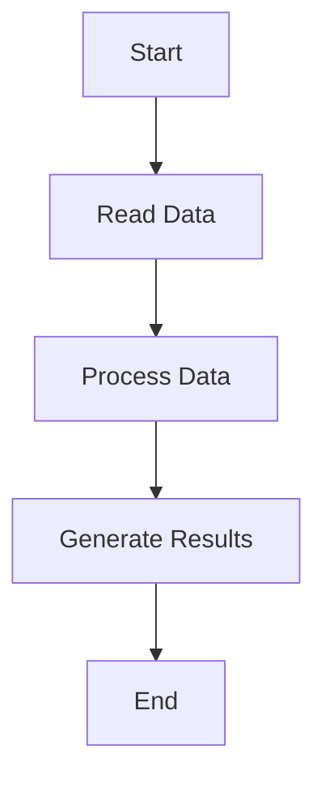

---

# 2. Left-to-Right Flowchart

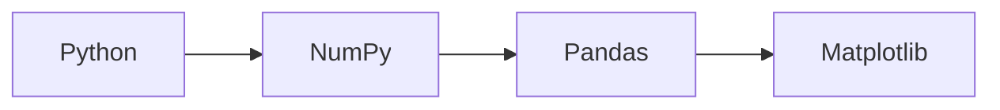

---

# 3. Decision Tree

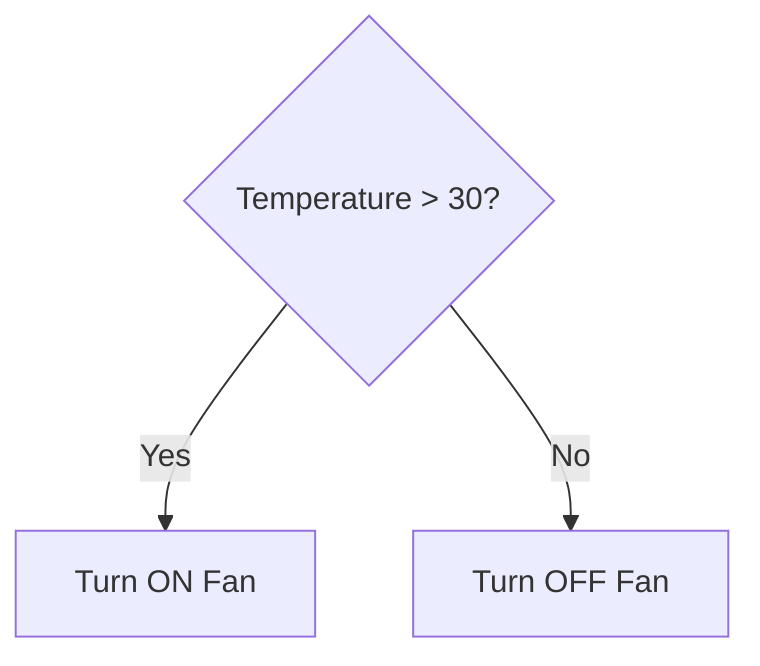

---

# 4. Sequence Diagram

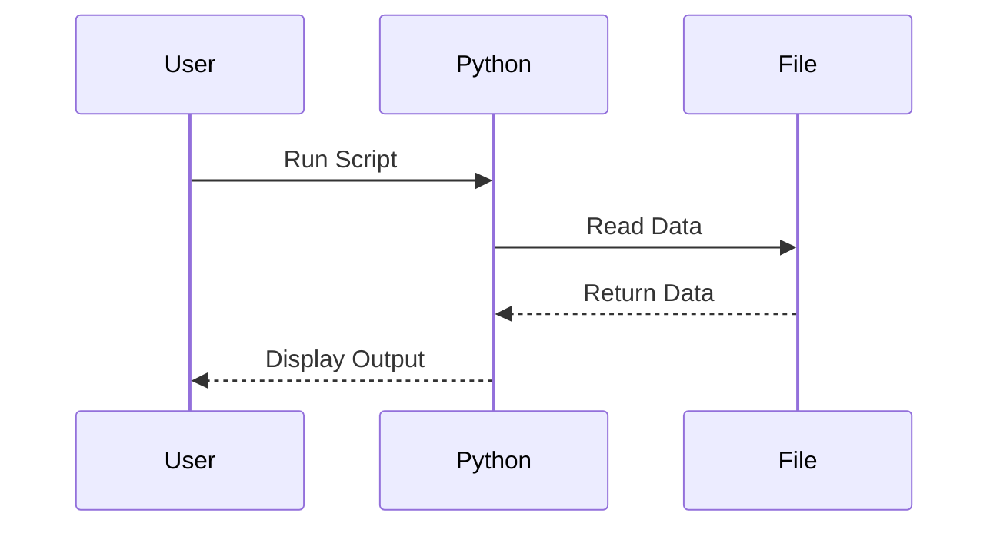

---

# 5. Class Diagram

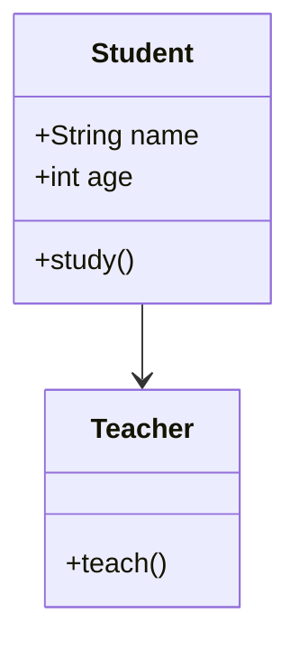

---

# 6. State Diagram

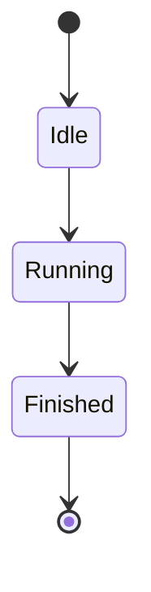

---

# 7. Pie Chart

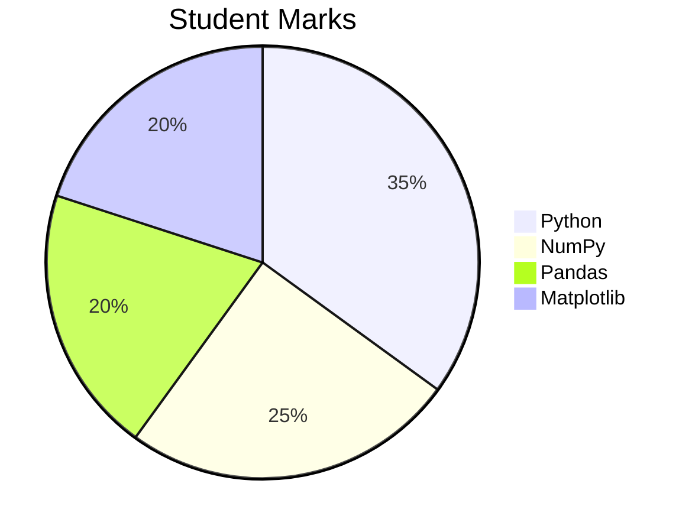

---

# 8. Git Graph

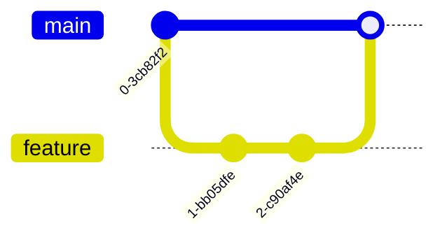

---

# 9. Entity Relationship Diagram

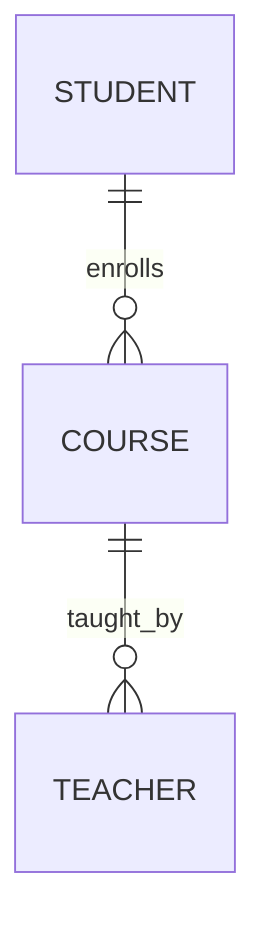

---

# 10. Gantt Chart

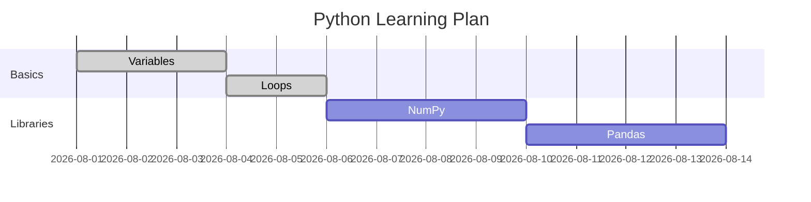

---

# 11. Mind Map

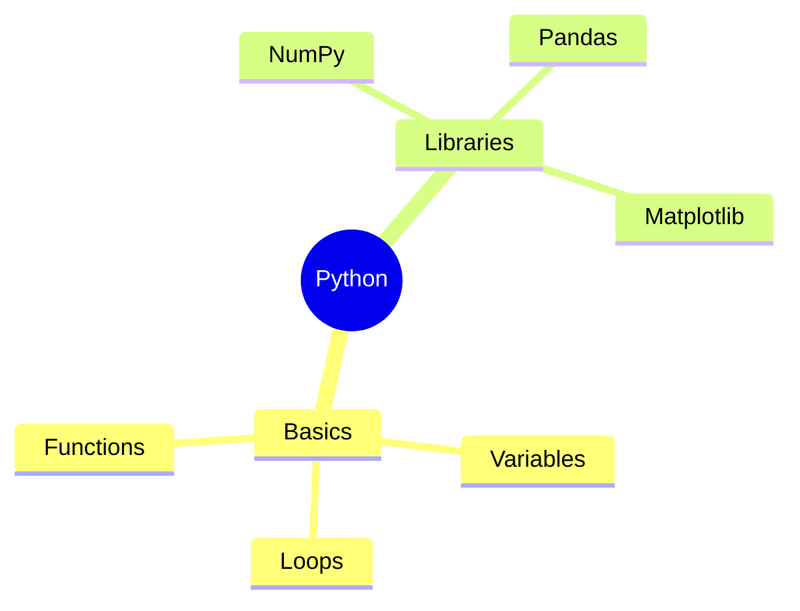

---

# 12. Journey Diagram

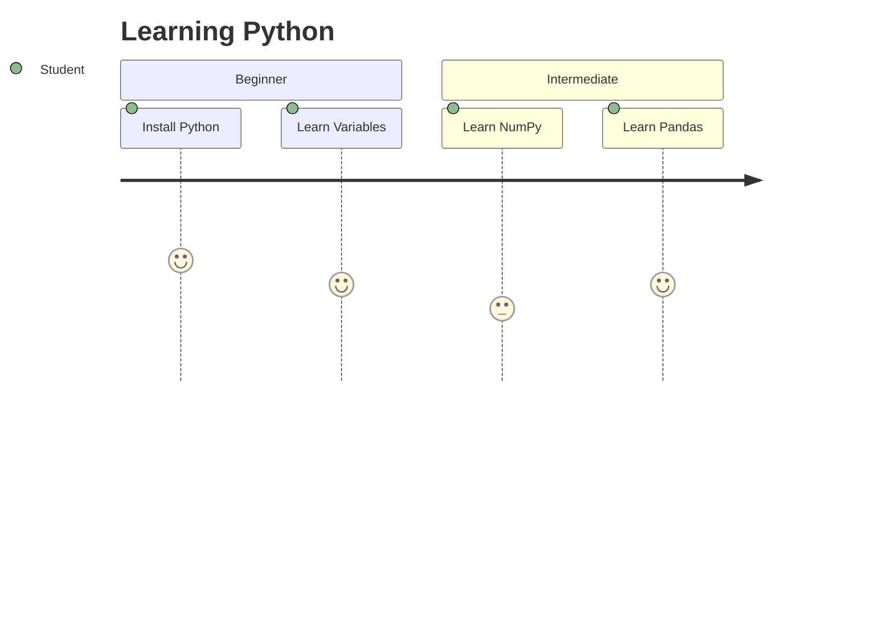
1. Mermaid (Most Popular)
Flowchart
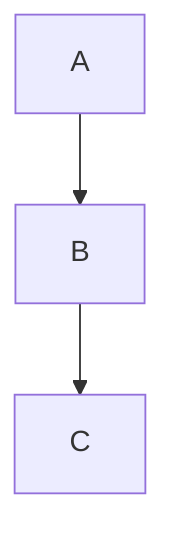
Graph
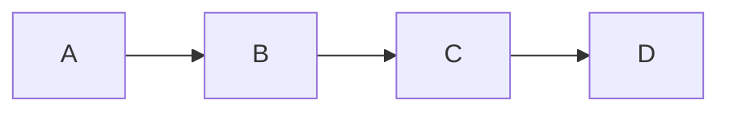
Sequence Diagram
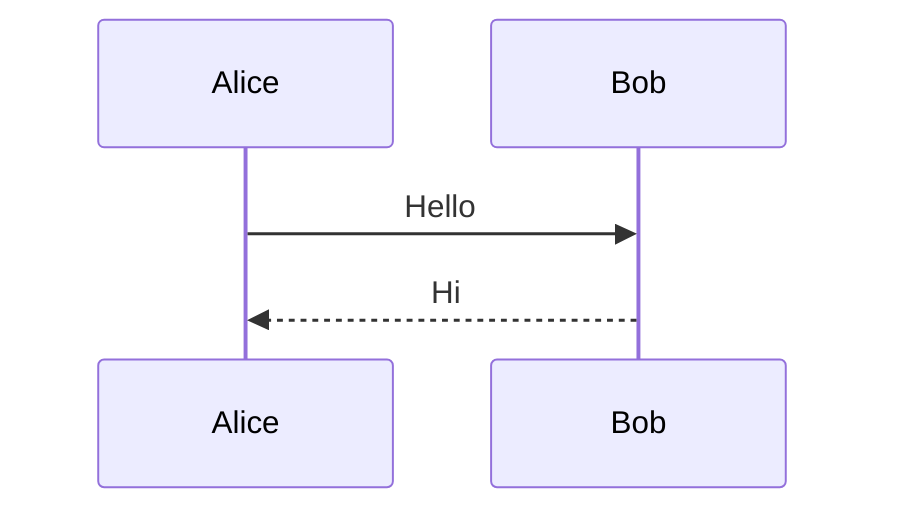
Class Diagram
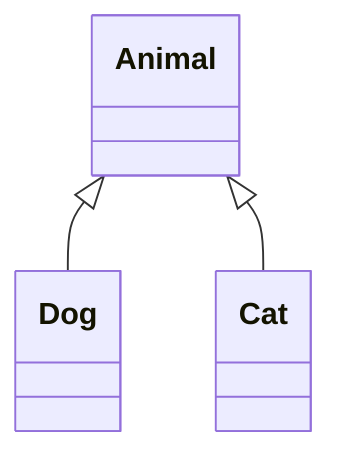
State Diagram
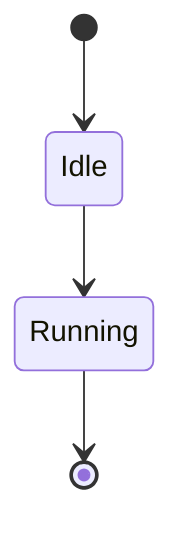
Pie Chart
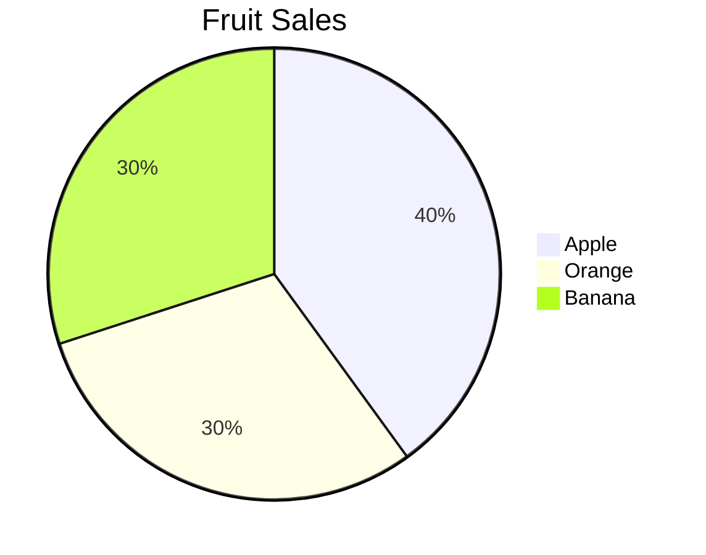
Gantt Chart
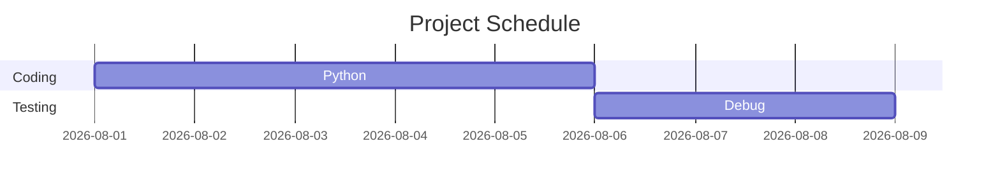
Mind Map
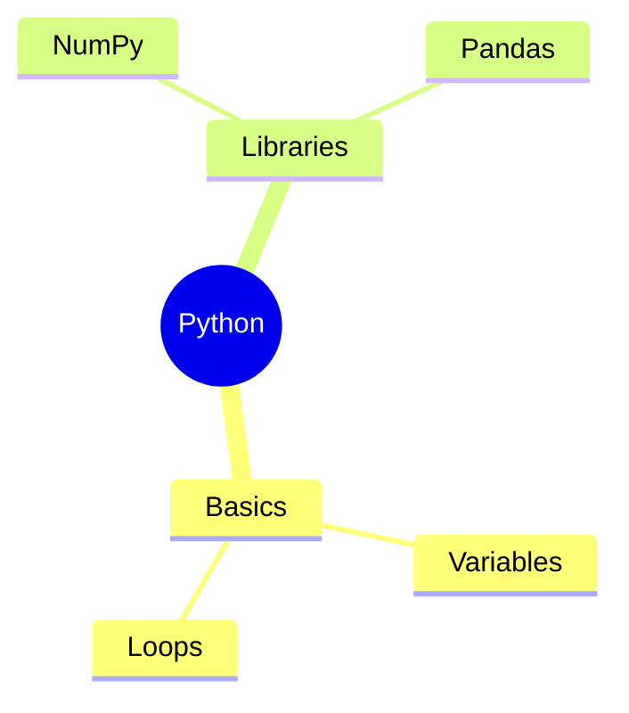
Entity Relationship Diagram
```mermaid
erDiagram
STUDENT ||--o{ COURSE : enrolls
```
Git Graph
```mermaid
gitGraph
commit
branch feature
checkout feature
commit
checkout main
merge feature
```
2. Graphviz (DOT)

Many Markdown editors support Graphviz.

```dot
digraph G {
    A -> B;
    B -> C;
    C -> D;
}
```
3. PlantUML
```plantuml
@startuml
Alice -> Bob: Hello
Bob --> Alice: Hi
@enduml
```
4. D2
```d2
A -> B
B -> C
C -> D
```
5. Vega-Lite (Data Charts)

Some Markdown systems (such as Jupyter Book and Observable) support Vega-Lite for charts.

```vega-lite
{
  "mark": "bar",
  "encoding": {
    "x": {"field": "Name", "type": "nominal"},
    "y": {"field": "Value", "type": "quantitative"}
  },
  "data": {
    "values": [
      {"Name":"A","Value":5},
      {"Name":"B","Value":10}
    ]
  }
}
```